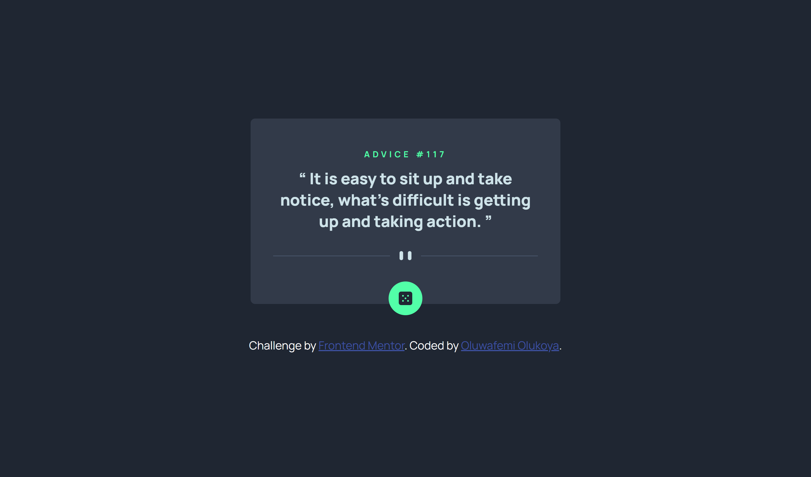

# Frontend Mentor - Advice generator app solution

This is a solution to the [Advice generator app challenge on Frontend Mentor](https://www.frontendmentor.io/challenges/advice-generator-app-QdUG-13db). Frontend Mentor challenges help you improve your coding skills by building realistic projects.

## Table of contents

- [Overview](#overview)
  - [The challenge](#the-challenge)
  - [Screenshot](#screenshot)
  - [Links](#links)
- [My process](#my-process)
  - [Built with](#built-with)
  - [What I learned](#what-i-learned)
  - [Continued development](#continued-development)
  - [Useful resources](#useful-resources)
- [Author](#author)

## Overview

### The challenge

Users should be able to:

- View the optimal layout for the app depending on their device's screen size
- See hover states for all interactive elements on the page
- Generate a new piece of advice by clicking the dice icon

### Screenshot



### Links

- Solution URL: [Advice Generator](https://github.com/Oluwafemi21/advice-generator)
- Live Site URL: [Advice Generator](https://oluwafemi21.github.io/advice-generator/)

## My process

### Built with

- Semantic HTML5 markup
- CSS custom properties
- Flexbox
- CSS Grid
- Axios 

### What I learned
- I learned how to use axios for fetching api

```html
<script src="https://unpkg.com/axios/dist/axios.min.js"></script>
```

```js
function getAdvice(){
    axios.get('https://api.adviceslip.com/advice')
    .then(data => updateAdvice(data))
    .catch(err => console.log(err)) 
}

```

### Continued development

- Learning more about API consumption using Axios

### Useful resources

- [Axios](https://axios-http.com/docs/example) - This is the AXIOS documentation. It helped me to get started with axios

## Author

- Frontend Mentor - [@Oluwafemi21](https://www.frontendmentor.io/profile/Oluwafemi21)
- Twitter - [@femi_io](https://www.twitter.com/femi_io)

